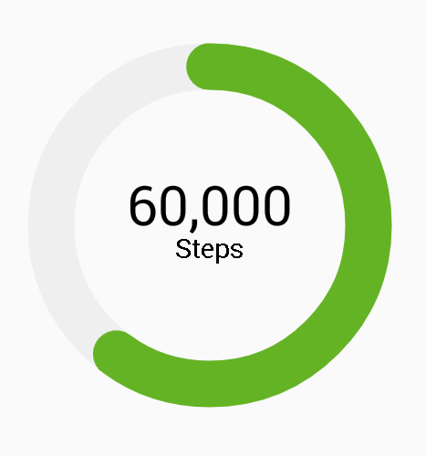
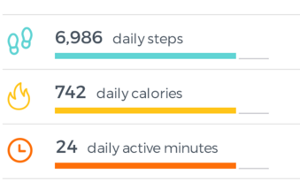

# Android-WheelProgress
A progress bar for my ongoing project.

## Download

via Gradle:

    dependencies {
      implementation 'com.zekapp.library:progreswheelview:1.1.5'
    }
    
## Usage of Dial progress bar

       <com.app.progresviews.ProgressWheel
            android:id="@+id/wheelprogress"
            android:layout_width="150dp"
            android:layout_height="150dp"
            app:barWidth="17dp"
            app:marginBtwText= "15dp"
            app:countText="931,199"
            app:definitionText="Steps"
            app:countTextColor="@android:color/black"
            app:defTextColor="@android:color/black"
            app:progressColor="#64b324"
            app:defTextSize="10sp"
            app:countTextSize="20sp"
            app:percentage="90"/>
            
            
## Usage of Line progress bar

        <com.app.progresviews.ProgressLine
            android:id="@+id/progress_line"
            android:layout_width="0dp"
            android:layout_height="match_parent"
            android:layout_weight="0.9"
            app:definition="daily steps"
            app:value="10,000"
            app:lineBarWidth="7dp"
            app:valuePercentage="55"
            app:valueDefTextSize="20sp"
            app:lineProgressColor="#43bd9f"
            app:underLineColor="@android:color/darker_gray"
            />

## License

        Copyright (C) 2015 Zeki Guler
        Copyright (C) 2011 The Android Open Source Project
        
        Licensed under the Apache License, Version 2.0 (the "License");
        you may not use this file except in compliance with the License.
        You may obtain a copy of the License at
        
           http://www.apache.org/licenses/LICENSE-2.0
        
        Unless required by applicable law or agreed to in writing, software
        distributed under the License is distributed on an "AS IS" BASIS,
        WITHOUT WARRANTIES OR CONDITIONS OF ANY KIND, either express or implied.
        See the License for the specific language governing permissions and
        limitations under the License.